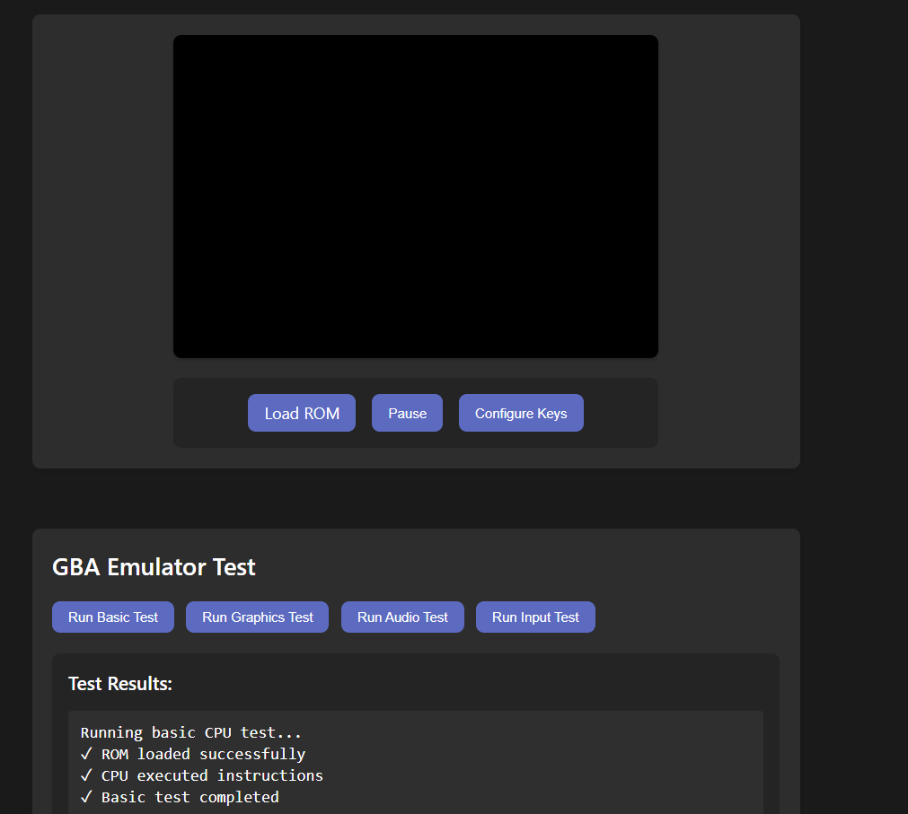

# 🎮 Angular GBA Emulator

  

  
  
  
  

使用 Angular 和 TypeScript 構建的 Game Boy Advance 模擬器。支持大多數 GBA 遊戲，並提供現代化的網頁界面。

## ✨ 特點

- 🎯 **高精度 CPU 模擬**

  - ARM7TDMI CPU 完整模擬
  - 支持 ARM 和 Thumb 指令集
  - 準確的時序模擬
- 🖼️ **圖形渲染**

  - WebGL 加速渲染
  - 支持所有 GBA 顯示模式
  - 精靈和背景圖層
  - 硬件加速縮放和旋轉
- 🔊 **音頻模擬**

  - Web Audio API 實現
  - 4個聲道完整支持
  - 高質量音頻輸出
  - 音量控制
- 💾 **存檔系統**

  - 支持遊戲內建存檔
  - 模擬器狀態保存/讀取
  - 自動存檔功能
  - 存檔數據壓縮和備份
- ⌨️ **輸入控制**

  - 可自定義按鍵映射
  - 支持鍵盤輸入
  - 按鍵配置保存

## 🚀 快速開始

### 環境要求

- Node.js (v14+)
- npm (v6+)
- Angular CLI

### 安裝
